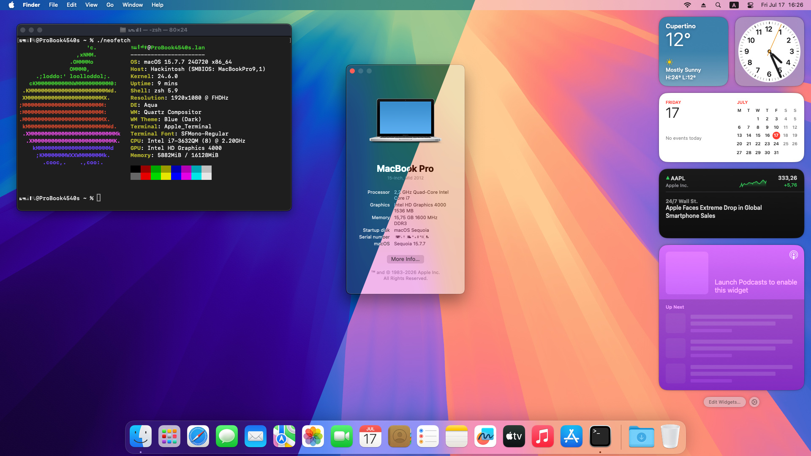

<p align="center"></p>
<h1 align="center">ProBook 4x40s OpenCore</h1>
<h3 align="center">4340s / 4540s / 4740s</h3>

Detailed instructions on how to install recent version of [macOS](https://en.wikipedia.org/wiki/MacOS) on HP ProBook 40s series laptops with third generation Ivy Bridge Intel Core i CPUs, – specifically, a [ProBook 4540s](https://support.hp.com/us-en/product/product-specs/model/5229457).



> [!IMPORTANT]
> A previous [guide for 30s series laptops](https://github.com/ubihazard/probook-4x30s-oc "macOS for ProBook 4x30s") with second generation Intel Sandy Bridge CPUs and non-metal graphics is still available for reference. Some content is kept there to avoid duplication.

> [!NOTE]
> In the process certain adjustments for your particular laptop will need to be made because ProBooks shipped in many different configurations. Therefore it is highly recommended that you read the official OpenCore [install guide](https://dortania.github.io/OpenCore-Install-Guide/ "OpenCore install guide") first to get familiar with the process. This will make it much easier for you to follow instructions and adapt them for you needs.

Despite effort was made to make all steps as easy to follow and clear as possible, the process is not straightforward and a certain level of skill, experience with command line, patience, and ability to troubleshoot are a must. A complete OpenCore [EFI folder](https://github.com/ubihazard/probook-4x40s-oc/releases/ "Download") is available for your reference.

Introduction
------------

Why ProBook 4540s? It’s a relatively modern-looking laptop from early 2010s that you can find for a pocket change on your local used market. The tough bastard has a stylish metal frame and a great scissor-switch keyboard. Together with older ProBook 4530s and EliteBook 8570p they resemble Apple’s famous (or infamous) [titanium PowerBook G4](https://en.wikipedia.org/wiki/PowerBook_G4#Titanium_(2001-2003)) and its later aluminum incarnation. With a handful of aftermarket upgrades it can still make a powerful machine for simple daily tasks. More importantly, even in stock condition it is fairly compatible with macOS.

We will be working with the following configuration[^1]:

| Item         | Description
| ------------ | -----------
| **CPU**      | Intel Core i7-3632QM
| **GPU**      | Intel HD 4000
| **RAM**      | 16 GB DDR3
| **SSD**      | 512 GB
| **Wireless** | Broadcom BCM94352HMB
| **Ethernet** | Realtek RTL8111
| **USB 3.0**  | ASMedia
| **Card Reader** | JMicron JMB38X
| **Optical Drive** | HP DVD-RAM GT80N
| **macOS**    | Sequoia 15.7.7
| **OpenCore** | [1.0.8-3eb5eea](https://github.com/ubihazard/OpenCorePkg-ProBook-Legacy/releases/tag/v1.0.8-3eb5eea) for legacy ProBook
| **OCLP** | [2.4.1](https://github.com/dortania/OpenCore-Legacy-Patcher/releases/tag/2.4.1)

[^1]: Webcam works up to Mojave. USB, Bluetooth and webcam need proper [USB port mapping](#fixing-usb).

OpenCore for Legacy ProBook
---------------------------

This guide now uses a [custom build](https://github.com/ubihazard/OpenCorePkg-ProBook-Legacy/releases) of OpenCore put together by me specifically for use with legacy ProBook laptops. It provides one important EFI module for ProBook 4x40s: BIOS fan reset.

  * `ProBookFanReset.efi` resets fan control from macOS back to automatic BIOS management. This needs to be done every time after using quiet fan patch to restore embedded controller state, and the best place to do it is during boot up.

> [!IMPORTANT]
> **Do not use this EFI module with any other laptop other than ProBook 30s or 40s series. Doing so can brick your device!**

Kernel Extensions
-----------------

  * `Lilu.kext` [1.7.2]: Basic kext required for patching
  * `ECEnabler.kext` [1.0.6]: Laptop battery patches
  * `WhateverGreen.kext` [1.7.0]: Graphics patches
  * `VirtualSMC.kext` [1.3.7]: SMC emulation
      * `SMCProcessor.kext`: CPU support
      * `SMCSuperIO.kext`: EC support
      * `SMCBatteryManager.kext`: Laptop battery
      * `SMCLightSensor.kext`: Laptop lid light sensor
  * `VoodooPS2Controller.kext` [1.9.2]: PS/2 input support
      * `VoodooPS2Keyboard.kext`
      * `VoodooPS2Trackpad.kext`
  * `RealtekRTL8111.kext` [3.0.0]: Wired ethernet
  * `AppleALC.kext` [1.9.7]: Audio patches
  * `USBMap.kext`: USB port map
      * `USBInjectAll.kext` [0.8.1]: Initial setup and port mapping
  * `BrcmFirmwareData.kext`: Broadcom firmware data
      * `BrcmFirmwareRepo.kext`
  * `BlueToolFixup.kext` [2.7.2]: Wireless (Bluetooth)
      * `BrcmBluetoothInjector.kext`
      * `BrcmPatchRAM3.kext`
      * `BrcmPatchRAM2.kext`
  * `AirportBrcmFixup.kext` [2.2.0]: Wireless (Wi-Fi)
      * `AirPortBrcmNIC_Injector.kext`
      * `AirPortBrcm4360_Injector.kext`
  * `JMB38X.kext` [1.5.0]: SD card reader
      * `HSSDBlockStorage.kext`
  * `FeatureUnlock.kext` [1.1.8]: Enable Sidecar, AirPlay, etc.
  * `IOSkywalkFamily.kext` [1.2.0]: Restore Broadcom wireless on Sonoma+
      * `IO80211FamilyLegacy.kext` [1.0.0]
  * `AppleIntelCPUPowerManagement.kext`: Restore legacy CPU PM
      * `AppleIntelCPUPowerManagementClient.kext`
  * `ASPP-Override.kext`: Force legacy CPU power management on Monterey
  * `ACPIPoller.kext`: Laptop fan control
  * `NoTouchID.kext`: Disable Touch ID
  * `SimpleMSR.kext`: Fix BD PROCHOT due to lack of working battery

We will be enabling some and disabling others during the [post-install](#post-install) stage to adjust for your own laptop configuration.

Installation
------------

> [!IMPORTANT]
> Update your laptop BIOS to the latest version from HP support website. The included ACPI patches should work with any BIOS version but only the latest was actually tested.

It is assumed that you are already familiar with [OpenCore](https://github.com/acidanthera/OpenCorePkg) bootloader, which is a backbone for all macOS installs on non-Apple hardware nowadays, its configuration process, and setup mechanics in general. To avoid repetition I will not be reproducing large config sections for each step. Refer to [4x30s guide](https://github.com/ubihazard/probook-4x30s-oc "ProBook 30s series install guide") and Dortania [Ivy Bridge laptop guide](https://dortania.github.io/OpenCore-Install-Guide/config-laptop.plist/ivy-bridge.html "Laptop Ivy Bridge OpenCore guide") in addition to this guide for details.

1.  Choose macOS version you would like to install. Monterey is recommended for a good combination of up-to-date software support and stable performance. Stick to Big Sur if you would like to avoid root patches or if you are stuck with Atheros Wi-Fi card and cannot upgrade to Broadcom. It is modern enough and has decent software support.

    Ventura and later require AVX2 emulation via [CryptexFixup](https://github.com/acidanthera/CryptexFixup), while Sequoia is the latest version you can install. The earliest macOS supported by this configuration is Mojave. Now, make a [bootable macOS USB installer](https://dortania.github.io/OpenCore-Install-Guide/installer-guide/) according to Dortania guide.

> [!NOTE]
> The EFI configuration for ProBook 40x series now uses new, more modern method of VMM spoofing for USB installer, which is required to install macOS Sequoia as it helps to avoid hideous “An error occurred while preparing the software update” message during the final step of installation process. It tricks macOS installer into thinking that it is running inside a VM, causing it to skip real Mac firmware installation, which is the root cause of the error above.
>
> This method of spoofing is *compatible only with Big Sur and above*. If, for some reason, you decide to install Catalina or older you need to make edits to `config-usb.plist`.
>
>   * Disable `Skip board ID check` [patch](https://github.com/ubihazard/probook-4x40s-oc/blob/b20bbb4985a02d46d8444ee707b4d99e73c7db6f/EFI/OC/config-usb.plist#L1190) under `Booter/Patch`.
>   * Remove `sbvmm` quirk from `RestrictEvents` settings [stored in a NVRAM parameter](https://github.com/ubihazard/probook-4x40s-oc/blob/b20bbb4985a02d46d8444ee707b4d99e73c7db6f/EFI/OC/config-usb.plist#L2323).

2.  Mount EFI partition on a USB installer and copy OpenCore files downloaded from [releases page](https://github.com/ubihazard/probook-4x40s-oc/releases/latest "Download"). Replace `config.plist` with `config-usb.plist` to keep the configuration variant modified specifically for use with macOS installer.

3.  If you own a 4740s model ProBook with HD+ 1600x900 screen or replaced your 4540s stock LCD panel with a full HD one, an iGPU device parameter must be adjusted to enable proper operation of your laptop screen.

    Find the `AAPL,ig-platform-id` key under `DeviceProperties/Add/PciRoot(0x0)/Pci(0x2,0x0)` section and change it from `AwBmAQ==` to `BABmAQ==` for both regular and USB version of `config.plist` before starting the setup process:

    ```xml
    <key>AAPL,ig-platform-id</key>
    <data>BABmAQ==</data>
    ```

4.  Unless your ProBook already comes with a Core i7-3632QM, like mine, you need to temporarily disable CPU power management before it can be restored during a post-install step later.

      * Open `config.plist` copied to EFI partition on a USB drive. Disable the `SSDT-PM.aml` ACPI table: under `ACPI/Add` set `Enabled` to `false`.
      * Drop `CpuPm` and `Cpu0Ist` OEM CPU tables: under `ACPI/Delete` set `Enabled` to `true`.
      * Enable `NullCPUPowerManagement.kext`: under `Kernel/Add` set `Enabled` to `true`.

5.  Reboot your ProBook with the USB installer. During setup the machine will restart several times and if everything goes well you will end up on macOS welcome screen.

6.  Copy OpenCore files to your system EFI partition so you can boot without USB. This time keep the `config.plist` from [EFI folder](https://github.com/ubihazard/probook-4x40s-oc/releases/latest "Download"), not `config-usb.plist`.

7.  Connect ethernet cable to your laptop. The next step requires working internet connection to download Intel CPU PM ACPI tables so we can restore power management for the exact processor used in your ProBook. Without proper CPU PM `AppleIntelCPUPowerManagement.kext` would cause kernel panic at boot so `NullCPUPowerManagement.kext` is used (in USB `config.plist`) to temporarily overtake control from it.

      * Follow the Dortania [guide](https://dortania.github.io/OpenCore-Post-Install/universal/pm.html#sandy-and-ivy-bridge-power-management) to create `SSDT-PM.aml` table for the CPU installed in your laptop.

      * Mount your EFI system partition (replace `X` and `Y` with your EFI disk identifiers) which is not on a USB:

        ```bash
        diskutil list
        sudo diskutil mount diskXsY
        ```

      * Copy the `ssdt.aml` generated by [ssdtPRGen.sh](https://github.com/Piker-Alpha/ssdtPRGen.sh) script to your EFI ACPI folder as `SSDT-PM`:

        ```bash
        cp ~/Library/ssdtPRGen/ssdt.aml /Volumes/EFI/EFI/OC/ACPI/SSDT-PM.aml
        ```

      * Re-enable `SSDT-PM.aml` ACPI table in `config.plist` in `ACPI/Add` section.

      * Restore previously deleted `CpuPm` and `Cpu0Ist` tables under `ACPI/Delete`.

      * Locate `NullCPUPowerManagement.kext` entry in `Kernel/Add` and disable it.

      * For Monterey or later make sure `ASPP-Override.kext` is enabled too. It is required to restore legacy CPU power management which was at some point removed in Monterey.

8.  The USB port map kext from the provided EFI folder should work for all ProBook 4540s models. If you’d like to make your own, use [USBMap](https://github.com/corpnewt/USBMap) while still booted from the USB to re-map ports and make your own `USBMap.kext`. This procedure is fully covered in Dortania [guide](https://dortania.github.io/OpenCore-Post-Install/usb/ "USB port mapping guide") and I won‘t be duplicating it here.

9.  For laptops with additional discrete GPU it needs to be disabled. There are two ways you can go about this.

      * The Radeon GPU installed in such old ProBooks is not very useful. It lacks up-to-date drivers from AMD and doesn’t actually perform much faster than integrated Intel HD 4000 graphics in modern games. Not to mention it also consumes extra power and generates more heat. Because of this you might want to simply disable it in BIOS. This is the recommended approach.

      * If you want to keep your Radeon GPU available, a [patch](#disabling-radeon) must be applied to disable it in macOS.

        1.  Turn on “Switchable Graphics” in BIOS.
        2.  Enable `SSDT-dGPU-OFF.aml` and `SSDT-dGPU-OFF2.aml` ACPI tables in `ACPI/Add`.
        3.  Activate the following ACPI patches in `ACPI/Patch`:
              * `GFX0 Method(PX02,1,S) to ZX02`
              * `DGFX Method(_INI,0,N) to ZINI`
              * `EC Method(_REG,2,N) to XREG`
              * `_PTS to ZPTS`
              * `_WAK to ZWAK`

Post-install
------------

We still got [stuff to do](https://dortania.github.io/OpenCore-Post-Install/ "Post-installation guide") to make the system fully usable. Unless you decided to install Big Sur or earlier, you’d be stuck without hardware graphics acceleration and, as a result, very slow and unusable user interface. This and other things, like Wi-Fi and Bluetooth, is fixed here.

1.  Set the values of `MinVersion` and `MinDate` in `UEFI/APFS` [according](https://dortania.github.io/OpenCore-Install-Guide/config-laptop.plist/ivy-bridge.html#apfs) to macOS version you have installed. For Big Sur and above just leave both at `0`.

2.  Disable SIP in `NVRAM/Add/7C436110-AB2A-4BBB-A880-FE41995C9F82` (the configured value is `0x803`):

    ```xml
    <key>csr-active-config</key>
    <data>AwgAAA==</data>
    ```

    > We don’t explicitly disable AMFI via `amfi=0x80` boot arg because it is handled by `AMFIPass.kext` in updated configuration instead.

3.  Enable Wi-Fi and Bluetooth. See [here](https://github.com/ubihazard/probook-4x30s-oc#enabling-wifi-and-bluetooth) if you’ve got Atheros card with Big Sur and [here](https://github.com/ubihazard/probook-4x30s-oc#broadcom-configuration) if you’ve installed a compatible Broadcom card. Sonoma and later need a root patch to restore Broadcom Wi-Fi. It is installed in the next step.

4.  Intel HD 4000 isn’t natively supported by macOS since Monterey. [OpenCore Legacy Patcher](https://github.com/dortania/OpenCore-Legacy-Patcher "OCLP") must be used to install patched graphics kexts and frameworks that restore hardware graphics acceleration. Download OCLP and allow it to install root patches. During this step the “Modern wireless” patch would be applied as well, if you are using Broadcom wireless on Sonoma+.

> [!NOTE]
> Sequoia may require internet connection to download recent frameworks and fix HD 4000 graphics. Use wired ethernet or patch wireless first, reboot and relaunch OCLP to patch graphics.

5.  Enable JMicron [card reader](https://github.com/ubihazard/probook-4x30s-oc#enabling-sd-card-reader). ProBooks 4x30s and 4x40s share the same exact card reader model.

6.  The trackpad [configuration](https://github.com/ubihazard/probook-4x30s-oc#configuring-trackpad) is identical to previous gen ProBooks. For 40s series we are still using older but perfectly functional `VoodooPS2Controller.kext` from RehabMan. The Acidanthera [fork](https://github.com/acidanthera/VoodooPS2) with Magic Trackpad II emulation unfortunately doesn’t appear to support Synaptics hardware used in these old ProBooks.

7.  Choose your preferred Fn key [behavior](https://github.com/ubihazard/probook-4x30s-oc#function-keys).

8.  Set the appropriate SMBIOS for your laptop: `MacBookPro9,1` if you’ve got a quad-core CPU installed in your ProBook, `MacBookPro9,2` for dual-core systems. If you need to change from the stock `MacBookPro9,1` name set in the [provided](EFI/OC/config.plist#L2501) `config.plist` make sure to also [adjust](https://github.com/ubihazard/probook-4x30s-oc#usb-port-mapping-in-smbios) both USB map kexts (there’s an additional `USBMap.kext` in `Legacy` subfolder). Now you can use `macserial` tool from OpenCore utilities to generate serials:

    ```bash
    ./macserial -m 'MacBookPro9,1' -n 1
    ```

    The system serial number you generated must be reported as “invalid” or “not found” on Apple [support coverage](https://checkcoverage.apple.com/ "Serial number check") page. If it comes back as “valid”, it means `macserial` somehow generated a number that belongs to an actual produced Mac, and you must generate another pair of serials.

    [Fill](https://github.com/ubihazard/probook-4x30s-oc#filling-your-system-information) the rest of system information.

9.  To [fix](https://github.com/ubihazard/probook-4x30s-oc#windows-dual-boot-issues) dual-boot issues with Windows we need to make couple adjustments. Set `CustomSMBIOSGuid` to `true` under `Kernel/Quirks`:

    ```xml
    <key>CustomSMBIOSGuid</key>
    <true/>
    ```

    Change `UpdateSMBIOSMode` from `Create` to `Custom` in `PlatformInfo`:

    ```xml
    <key>UpdateSMBIOSMode</key>
    <string>Custom</string>
    ```

10. Hibernation is not supported on a hackintosh. It must be [disabled](https://github.com/ubihazard/probook-4x30s-oc#disabling-hibernation):

    ```bash
    sudo pmset -a hibernatemode 0
    ```
    ```bash
    sudo rm /var/vm/sleepimage
    sudo mkdir /var/vm/sleepimage
    ```

11. Make sure to [enable TRIM](https://github.com/ubihazard/probook-4x30s-oc#enabling-trim) for your SATA SSD (ignore the warning):

    ```bash
    sudo trimforce enable
    ```

12. Apply the [quiet fan patch](https://github.com/ubihazard/probook-4x30s-oc#quiet-fan-patch) for much better fan behavior.

13. [Customize](https://github.com/ubihazard/probook-4x30s-oc#custom-drive-icon-and-label) your macOS installation entry in OpenCore boot picker.

Disabling Radeon
----------------

Many laptops come in a dual-GPU setup where iGPU is combined with a more powerful discrete graphics card and some switching mechanism is employed to toggle between them depending on current graphical demands, – ProBooks aren‘t an exception. Both Sandy Bridge and Ivy Bridge ProBooks had configurations with discrete AMD Radeon GPUs. These GPUs have no support in macOS and must be disabled to avoid boot issues and achieve a properly working system.

The most obvious and easy way to do so is simply disabling discrete GPU in BIOS. If you have no use of it in any other operating system, this is the preferred solution. If, however, you insist on having it available in, let’s say, Windows, for some old games maybe, or you’re just being pedantic, a more fine-grained approach in a form of ACPI patch is required to disable Radeon GPU exclusively in macOS.

Such [disable patch](ACPI/SSDT-dGPU-OFF.dsl) has already been made by me for my ProBook 4540s (it‘s a [two-step](ACPI/SSDT-dGPU-OFF2.dsl) patch actually). Here I attempt to explain how this patch was created in case if you want to make similar patch for a different laptop or if you’re simply interested. This approach is valid for most laptops released in early 2010s using simple switchable graphics. For modern laptops and those using NVIDIA Optimus technology refer to [Dortania dGPU disable guide](https://dortania.github.io/Getting-Started-With-ACPI/Laptops/laptop-disable.html).

### 0. What You Need

  * Live Linux USB distro.
  * Semi-decent plain text editor ([Cot](https://coteditor.com/) would suffice).
  * Binary hex editor ([HexFiend](https://hexfiend.com/) is okay).
  * Basic knowledge of programming.
  * Some brains.

### 1. Extracting ACPI Tables

Using a live Linux USB, boot it up and extract ACPI tables:

```bash
sudo acpidump > acpi_tables.txt
acpixtract -a acpi_tables.txt
```

(You might need to install `acpidump` first: e.g. `sudo apt-get install acpidump` if using Ubuntu.)

Copy extracted `.aml` tables to another USB stick and transfer them to your work environment. The tables that you extracted are in a compiled binary format. Use [iasl]() and a [decompilation script](ACPI/decompile.sh) to convert them into readable source text format.

### 2. Finding References to dGPU

Now we need to locate references to discrete GPU in laptop’s ACPI code. We don’t need just any reference though: specifically, we are looking for `_INI` and `_OFF` methods which, as the names suggest, are responsible for turning the GPU on and off respectively.

```bash
grep -i 'Method.*_INI' *.dsl
```

```
dsdt.dsl:        Method (_INI, 0, NotSerialized)  // _INI: Initialize
dsdt.dsl:                Method (_INI, 0, NotSerialized)  // _INI: Initialize
dsdt.dsl:                    Method (_INI, 0, NotSerialized)  // _INI: Initialize
dsdt.dsl:                    Method (_INI, 0, NotSerialized)  // _INI: Initialize
dsdt.dsl:                Method (_INI, 0, NotSerialized)  // _INI: Initialize
ssdt3.dsl:        Method (_INI, 0, NotSerialized)  // _INI: Initialize
```

```bash
grep -i 'Method.*_OFF' *.dsl
```

```
dsdt.dsl:                            Method (_OFF, 0, NotSerialized)  // _OFF: Power Off
dsdt.dsl:                            Method (_OFF, 0, NotSerialized)  // _OFF: Power Off
dsdt.dsl:                    Method (_OFF, 0, NotSerialized)  // _OFF: Power Off
ssdt3.dsl:        Method (_OFF, 0, Serialized)  // _OFF: Power Off
```

Well, that was almost too easy: we quickly discover a suspiciously looking `ssdt3.dsl` table which is separate from main `dsdt.dsl` and contains single unique references to both `INI` and `OFF` (ACPI specification requires identifiers to be four characters long, thus additional `_`). Opening it in a plain text editor we can clearly see it can only be responsible for our dedicated GPU (`_SB_.PCI0.GFX0` ACPI path gives it away instantly):

```asl
DefinitionBlock ("", "SSDT", 1, "SgRef", "SgTabl", 0x00001000)
{
    External (_SB_.PCI0.GFX0, DeviceObj)
    External (_SB_.PCI0.GFX0._DOD, MethodObj)    // 0 Arguments
    External (_SB_.PCI0.GFX0.DD01._ADR, MethodObj)    // 0 Arguments
    // SSDT continues...
```

### 3. How OpenCore ACPI Patches are Made

The general approach to ACPI patching is:

  * Rename the method that you want to change.
  * Create a new method with original name and modified code. It can reference other stuff in DSDT and potentially call the original renamed method if needed.
  * Repeat for other methods you wish to patch.
  * Place all new code in a separate SSDT table(s) and inject it into ACPI using OpenCore during boot process.

### 4. dGPU Disable Patch, Pt. 1

Let‘s find out where our Radeon GPU gets enabled. The first method we bump into is `PX02` which contains some logic to turn dGPU on or off based on a parameter:

```asl
Method (PX02, 1, Serialized)
{
    CreateWordField (Arg0, 0x00, SIZI)
    CreateByteField (Arg0, 0x02, PWST)
    And (PWST, 0x01, PWST)
    If (PWST)
    {
        \_SB.PCI0.PEGP.DGFX._ON ()
    }
    Else
    {
        \_SB.PCI0.PEGP.DGFX._OFF ()
    }
}
```

We just want it off always so we create our own version of `PX02` method:

```asl
// Original PX02 is renamed to ZX02
Method (PX02, 1, Serialized)
{
    // Prevent Radeon 7650M from turning on
    ZX02 (Zero)
}
```

Notice we are calling the original (soon to be renamed) `ZX02` method, but we are feeding it with a constant zero argument, which causes it to take the `_OFF` code path all the time, unconditionally, and simply ignore whatever argument comes to us.

Now let’s take a look at the `_INI` method:

```asl
Method (_INI, 0, NotSerialized)  // _INI: Initialize
{
    Store (0x00, \_SB.PCI0.PEGP.DGFX._ADR)
}
```

We can rewrite it to make it call `_OFF` immediately after the GPU is initialized:

```asl
// Original _INI is renamed to ZINI
Method (_INI, 0, NotSerialized)
{
    // Turn Radeon 7650M off
    ZINI()
    _OFF()
}
```

The complete first patch organized into SSDT table can be found [here](ACPI/SSDT-dGPU-OFF2.dsl) (it’s second in the repo).

### 5. dGPU Disable Patch, Pt. 2

This could be it, but unfortunately things aren’t as simple. Although the above patch will work for turning off dGPU at boot, laptop firmware still changes dGPU state when laptop goes to sleep (off) and wakes up (on). Therefore we need to make a patch that will turn dGPU back on right before machine goes to sleep (because firmware expects it to be on) and turn it off again after laptop wakes up, negating the firmware behavior.

Opening up main `dsdt.dsl` ACPI table we are looking for `_PTS` (“prepare to sleep”) and `_WAK` (“wake”) methods:

```asl
Method (_PTS, 1, NotSerialized)  // _PTS: Prepare To Sleep
{
    // Omitted for brevity
}
```

```asl
Method (_WAK, 1, NotSerialized)  // _WAK: Wake
{
    // Omitted for brevity
}
```

Using the familiar approach we “rename” the original methods and create our patched replacements (actual renaming will happen later):

```asl
// Original _PTS is renamed to ZPTS
Method (_PTS, 1, NotSerialized)  // _PTS: Prepare To Sleep
{
    // Enable Radeon 7650M dGPU before sleeping
    External(\_SB.PCI0.PEGP.DGFX._ON, MethodObj)
    if (CondRefOf(\_SB.PCI0.PEGP.DGFX._ON))
    {
        \_SB.PCI0.PEGP.DGFX._ON()
    }

    External(\ZPTS, MethodObj)
    ZPTS(Arg0)
}
```

```asl
// Original _WAK is renamed to ZWAK
Method (_WAK, 1, NotSerialized)  // _WAK: Wake
{
    If (Arg0 < 1 || Arg0 > 5) { Arg0 = 3 }
    External(\ZWAK, MethodObj)
    Local0 = ZWAK(Arg0)

    // Disable Radeon 7650M dGPU on wake
    External(\_SB.PCI0.PEGP.DGFX._OFF, MethodObj)
    if (CondRefOf(\_SB.PCI0.PEGP.DGFX._OFF))
    {
        \_SB.PCI0.PEGP.DGFX._OFF()
    }

    Return(Local0)
}
```

There’s another method we want to address in the main table, `_REG` [inside](ACPI/Original/dsdt.dsl#L6689) embedded controller device:

```asl
Method (_REG, 2, NotSerialized)  // _REG: Region Availability
{
    If (LEqual (Arg0, 0x03))
    {
        Store (Arg1, ECRG)
        Store (LOr (LEqual (\WCOS (), 0x01), LEqual (\WCOS (), 0x02)), Local1)
        If (LAnd (Arg1, LNot (Local1)))
        {
            ECRI ()
        }
    }
}
```

```asl
// Original _REG is renamed to XREG
Method (_REG, 2, NotSerialized)  // _REG: Region Availability
{
    XREG(Arg0, Arg1)

    // Disable Radeon 7650M dGPU
    if (LAnd (LEqual (Arg0,3), LEqual (Arg1,1)))
    {
        External(\_SB.PCI0.PEGP.DGFX._OFF, MethodObj)
        if (CondRefOf(\_SB.PCI0.PEGP.DGFX._OFF))
        {
            \_SB.PCI0.PEGP.DGFX._OFF()
        }
    }
}
```

The complete second patch is [available](ACPI/SSDT-dGPU-OFF.dsl) for reference.

### 6. Compiling SSDT Tables with Patches

Our plain text code must be turned into binary code usable by ACPI interpreter. This is done by means of [compiling](https://github.com/ubihazard/probook-4x40s-oc/releases/ "RehabMan legacy ProBook macOS tools"):

```bash
iasl -vw 2095 -vw 2146 -vw 2089 -vw 4089 -vi -vr -p SSDT-dGPU-OFF.aml SSDT-dGPU-OFF.dsl
iasl -vw 2095 -vw 2146 -vw 2089 -vw 4089 -vi -vr -p SSDT-dGPU-OFF2.aml SSDT-dGPU-OFF2.dsl
```

The above commands will produce two binary files: `SSDT-dGPU-OFF.aml` and `SSDT-dGPU-OFF2.aml` that must be copied to `EFI/OC/ACPI`.

### 7. Creating Rename Patches for Original Methods

It was mentioned earlier several times that we need to rename original methods in order to replace them with our patched ones. So far we were looking at plain text code where these methods are used as if they were already renamed. But to actually rename them we have to create binary ACPI patches because obviously these methods don’t exist in plain text form. We will use OpenCore ACPI patching mechanisms to accomplish this.

Open the original binary files of ACPI tables we were working on (`dsdt.aml` and `ssdt3.aml`) in a hex editor. Let’s say we want to create a binary rename patch for the `_REG` method inside `EC0`. Looking at `dsdt.aml` opened in a hex editor, search for `_REG` ASCII string. There are many `_REG` methods in `dsdt.aml` that belong to various devices in search results but the one we are interested in is located at offset `0x6F08`: we can easily discern that by looking at surrounding binary code which shows many familiar identifiers (`PRIT`, `ECRG`, `WCOS`, etc.) that we saw in a source code of the `_REG` method we’ve been working on.

Select ten bytes in a binary view starting at offset `0x6F08`, which gives us `5F52454702A02893680A03`. This will be our search pattern for the binary rename patch. This patch must be unique across entire ACPI code, otherwise we risk renaming something completely different in unknown location with potentially bad consequences, – hence us selecting more bytes and not just four. The original `_REG` ASCII string must be transformed into `XREG` in our patch so we modify the original pattern to derive our replacement from it: `5852454702A02893680A03`. Here we changed just one byte, `5F` to `58`, which is ASCII hexadecimal code for `X`.

To finalize our patch we must convert it to OpenCore configuration format which accepts binary values in Base64 encoding. Using the following commands we convert our hexadecimal patterns to Base64:

```bash
> echo 5F52454702A02893680A03 | xxd -ps -r | base64
> X1JFRwKgKJNoCgM=
```

```bash
> echo 5852454702A02893680A03 | xxd -ps -r | base64
> WFJFRwKgKJNoCgM=
```

First we convert them to actual binary (that can’t be printed to terminal) and then encode them with a Base64 encoding tool. The resulting OpenCore ACPI patch will look like this:

```xml
<dict>
    <key>Base</key>
    <string></string>
    <key>BaseSkip</key>
    <integer>0</integer>
    <key>Comment</key>
    <string>EC Method(_REG,2,N) to XREG</string>
    <key>Count</key>
    <integer>0</integer>
    <key>Enabled</key>
    <true/>
    <key>Find</key>
    <data>X1JFRwKgKJNoCgM=</data>
    <key>Limit</key>
    <integer>0</integer>
    <key>Mask</key>
    <data></data>
    <key>OemTableId</key>
    <data></data>
    <key>Replace</key>
    <data>WFJFRwKgKJNoCgM=</data>
    <key>ReplaceMask</key>
    <data></data>
    <key>Skip</key>
    <integer>0</integer>
    <key>TableLength</key>
    <integer>0</integer>
    <key>TableSignature</key>
    <data></data>
</dict>
```

Other rename patches are created in a same way.

### 8. Putting It All Together

Open `config.plist` and append entries for compiled SSDT tables under `ACPI/Add` section:

<details>
<summary><strong>Complete SSDT section</strong></summary><br>

```xml
<dict>
    <key>Comment</key>
    <string>Disable Radeon 7650M dGPU #1 (needs rename patch)</string>
    <key>Enabled</key>
    <true/>
    <key>Path</key>
    <string>SSDT-dGPU-OFF.aml</string>
</dict>
<dict>
    <key>Comment</key>
    <string>Disable Radeon 7650M dGPU #2 (needs rename patch)</string>
    <key>Enabled</key>
    <true/>
    <key>Path</key>
    <string>SSDT-dGPU-OFF2.aml</string>
</dict>
```
</details>

Patches with original method renames belong to `ACPI/Patch`:

<details>
<summary><strong>Complete rename section</strong></summary><br>

```xml
<dict>
    <key>Base</key>
    <string></string>
    <key>BaseSkip</key>
    <integer>0</integer>
    <key>Comment</key>
    <string>GFX0 Method(PX02,1,S) to ZX02</string>
    <key>Count</key>
    <integer>0</integer>
    <key>Enabled</key>
    <true/>
    <key>Find</key>
    <data>SAVQWDAy</data>
    <key>Limit</key>
    <integer>0</integer>
    <key>Mask</key>
    <data></data>
    <key>OemTableId</key>
    <data></data>
    <key>Replace</key>
    <data>SAVaWDAy</data>
    <key>ReplaceMask</key>
    <data></data>
    <key>Skip</key>
    <integer>0</integer>
    <key>TableLength</key>
    <integer>0</integer>
    <key>TableSignature</key>
    <data></data>
</dict>
<dict>
    <key>Base</key>
    <string></string>
    <key>BaseSkip</key>
    <integer>0</integer>
    <key>Comment</key>
    <string>DGFX Method(_INI,0,N) to ZINI</string>
    <key>Count</key>
    <integer>0</integer>
    <key>Enabled</key>
    <true/>
    <key>Find</key>
    <data>FCBfSU5J</data>
    <key>Limit</key>
    <integer>0</integer>
    <key>Mask</key>
    <data></data>
    <key>OemTableId</key>
    <data></data>
    <key>Replace</key>
    <data>FCBaSU5J</data>
    <key>ReplaceMask</key>
    <data></data>
    <key>Skip</key>
    <integer>0</integer>
    <key>TableLength</key>
    <integer>0</integer>
    <key>TableSignature</key>
    <data></data>
</dict>
<dict>
    <key>Base</key>
    <string></string>
    <key>BaseSkip</key>
    <integer>0</integer>
    <key>Comment</key>
    <string>EC Method(_REG,2,N) to XREG</string>
    <key>Count</key>
    <integer>0</integer>
    <key>Enabled</key>
    <true/>
    <key>Find</key>
    <data>X1JFRwKgKJNoCgM=</data>
    <key>Limit</key>
    <integer>0</integer>
    <key>Mask</key>
    <data></data>
    <key>OemTableId</key>
    <data></data>
    <key>Replace</key>
    <data>WFJFRwKgKJNoCgM=</data>
    <key>ReplaceMask</key>
    <data></data>
    <key>Skip</key>
    <integer>0</integer>
    <key>TableLength</key>
    <integer>0</integer>
    <key>TableSignature</key>
    <data></data>
</dict>
<dict>
    <key>Base</key>
    <string></string>
    <key>BaseSkip</key>
    <integer>0</integer>
    <key>Comment</key>
    <string>_PTS to ZPTS</string>
    <key>Count</key>
    <integer>0</integer>
    <key>Enabled</key>
    <true/>
    <key>Find</key>
    <data>X1BUUwE=</data>
    <key>Limit</key>
    <integer>0</integer>
    <key>Mask</key>
    <data></data>
    <key>OemTableId</key>
    <data></data>
    <key>Replace</key>
    <data>WlBUUwE=</data>
    <key>ReplaceMask</key>
    <data></data>
    <key>Skip</key>
    <integer>0</integer>
    <key>TableLength</key>
    <integer>0</integer>
    <key>TableSignature</key>
    <data></data>
</dict>
<dict>
    <key>Base</key>
    <string></string>
    <key>BaseSkip</key>
    <integer>0</integer>
    <key>Comment</key>
    <string>_WAK to ZWAK</string>
    <key>Count</key>
    <integer>0</integer>
    <key>Enabled</key>
    <true/>
    <key>Find</key>
    <data>X1dBSwE=</data>
    <key>Limit</key>
    <integer>0</integer>
    <key>Mask</key>
    <data></data>
    <key>OemTableId</key>
    <data></data>
    <key>Replace</key>
    <data>WldBSwE=</data>
    <key>ReplaceMask</key>
    <data></data>
    <key>Skip</key>
    <integer>0</integer>
    <key>TableLength</key>
    <integer>0</integer>
    <key>TableSignature</key>
    <data></data>
</dict>
```
</details>

Keeping BD PROCHOT Away
-----------------------

Trying to use a MacBook without a working battery would result in an extremely slow and unresponsive system because MacBook firmware actively prevents using a laptop without one by means of throttling, causing CPU to run at its lowest clock speed. Normally, this shouldn’t affect hackintosh laptops because they don’t have a Mac firmware (although they might exhibit similar behavior due to firmware tricks of their own). However, it *does* affect Intel iGPU graphics performance, which manifests in unusually slow 3D in certain applications, like browsers, or weird graphical issues, such as missing textures or models.

Having no OEM batteries available for our ProBook we have to fix this issue by forcibly disabling BD PROCHOT, – a special CPU flag that operating system sets, which causes throttling.

Enable the `DisablePROCHOT.efi` bootloader driver:

<details>
<summary><strong>Example</strong></summary><br>

```xml
<dict>
    <key>Arguments</key>
    <string></string>
    <key>Comment</key>
    <string>DisablePROCHOT.efi</string>
    <key>Enabled</key>
    <true/>
    <key>LoadEarly</key>
    <false/>
    <key>Path</key>
    <string>DisablePROCHOT.efi</string>
</dict>
```
</details>

Enable the `SimpleMSR.kext` which will continue to keep BD PROCHOT disabled after startup, so it doesn’t return, e.g. after sleep:

<details>
<summary><strong>Example</strong></summary><br>

```xml
<dict>
    <key>Arch</key>
    <string>Any</string>
    <key>BundlePath</key>
    <string>SimpleMSR.kext</string>
    <key>Comment</key>
    <string>SimpleMSR.kext</string>
    <key>Enabled</key>
    <true/>
    <key>ExecutablePath</key>
    <string>Contents/MacOS/SimpleMSR</string>
    <key>MaxKernel</key>
    <string></string>
    <key>MinKernel</key>
    <string></string>
    <key>PlistPath</key>
    <string>Contents/Info.plist</string>
</dict>
```
</details>

ProBook 40s 16 GB RAM Issue
---------------------------

ProBook 40s laptops are known to suffer from a [weird firmware bug](https://h30434.www3.hp.com/t5/Notebook-Hardware-and-Upgrade-Questions/Performance-degrades-in-Probook-4540s-after-memory-upgrade/td-p/2268503) whereby installing 16 GB of RAM causes laptop to slow down to a crawl with a permanent near 100% CPU usage at idle. The cause of this behavior was never explained or addressed by HP, but, luckily, the solution was discovered and it is as simple as deducing 256 MB of RAM from the memory pool available to the system.

  * In macOS add the boot arg to extract 256 MB of RAM:

    ```xml
    <key>boot-args</key>
    <string>... maxmem=16128</string>
    ```

    > Actually, the issue is *least* prominent on macOS, having a mild effect maybe only on the startup process, while Windows 11 is rendered literally unbootable.

  * Use `msconfig` system tool on Windows and set available RAM to `16128`. Boot with a single 8 GB stick first if you can’t reach the desktop or need to install the operating system first.

  * Add `mem=16128M` kernel parameter if using a Linux-based OS.

ACPI Patching
-------------

Most ACPI patches for this laptop (and other ProBooks, EliteBooks, and ZBooks) were made by legendary [RehabMan](https://github.com/RehabMan/HP-ProBook-4x30s-DSDT-Patch) and then simply ported by me to work with OpenCore bootloader using his [patched DSDT](ACPI/RehabMan/4x40s_IvyBridge.txt) and hot patch guide as sources. Other SSDTs are provided by Dortania in their [Ivy Bridge laptop guide](https://dortania.github.io/OpenCore-Install-Guide/config-laptop.plist/ivy-bridge.html "Laptop Ivy Bridge OpenCore guide").

Credits
-------

All credits go to [RehabMan](https://github.com/RehabMan), [chris1111](https://github.com/chris1111), [acidanthera](https://github.com/acidanthera), [dortania](https://github.com/dortania), [moraea](https://github.com/moraea), and the rest of talented individuals who worked hard to make running macOS on regular PCs and unsupported hardware a reality.
